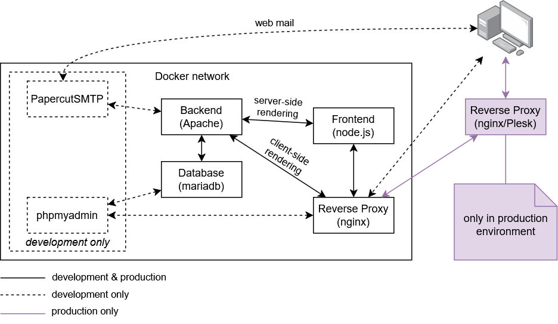

# Tech Stream Conference Website Docker Setup for Development

## Prerequisites

You need Docker with support for Docker Compose. The setup is only tested for Linux. If you're on Windows, we suggest you use WSL2. The easiest approach for Windows users is to enable WSL2, install Ubuntu 24.04 LTS (or similar), and Docker Desktop.
You'll also need a working Git setup.

## Installation

```sh
git clone --recursive git@github.com:TechStreamConference/website-docker.git
cd website-docker
./configure.sh
```

Confirm the prompt by typing `y` and the configure script will do the rest.

## Usage

After successful installation, you should be able to reach the following addresses using your browser:

- `http://localhost`: The website.
- `http://localhost/phpmyadmin`: Browser interface for database management.
- `http://localhost:8080`: Browser client for emails. The email server catches all sent emails.

The database server is also reachable on port 3306 (default username/password: `test_conf_user`/`1234`) from the host system.

For development, just open either the `/frontend` or `/backend` submodule in your favorite IDE and start hacking 😎

## Architecture

The following image illustrates the overall architecture of this project.


